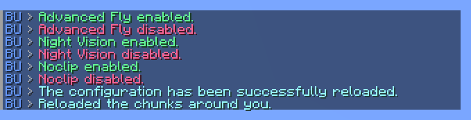
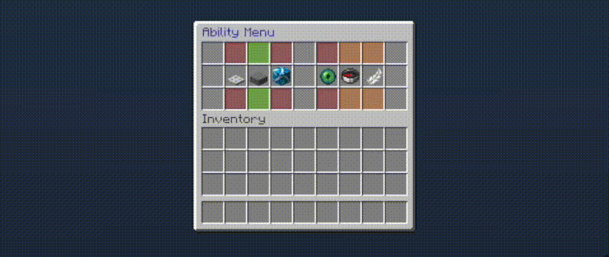
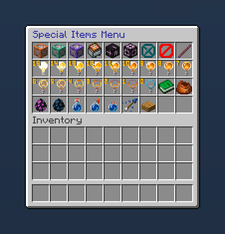

# BuildersUtilities

A curated bundle of tiny features that help builders do their thing.

* [Download](https://modrinth.com/plugin/buildersutilities)
* [Discord](https://thbn.me/discord)
* [Donate](https://github.com/sponsors/TehBrian) <3

---

## About

This is a fork of [Arcaniax's Builder's Utilities][arcaniax-bu] with
customizable messages and nicer-looking GUIs. Be aware that the two plugins do
not function exactly the same; they differ greatly in some areas.

[arcaniax-bu]: https://www.spigotmc.org/resources/builders-utilities.42361/

## What's different?

- Every message is easily configurable and uses [MiniMessage][MiniMessage] syntax.
- World interactions respect PlotSquared and WorldGuard restrictions.
- Both the permissions and the commands have been completely redone. (See the
	[plugin.yml][plugin.yml] for an updated list!)
- All the GUIs have been revamped. Everything looks and feels a lot nicer.

In addition to that, everything has been polished and reviewed, rigorously, by
me, over a couple sleepless nights. Now *that's* what I call quality code.

[MiniMessage]: https://docs.adventure.kyori.net/minimessage/

[plugin.yml]: https://github.com/TehBrian/BuildersUtilities/blob/main/src/main/resources/plugin.yml

## Screenshots

## Building

This project uses Gradle. To build, run `./gradlew build` in the project's root
directory. The built jar can be found in `build/libs`.
